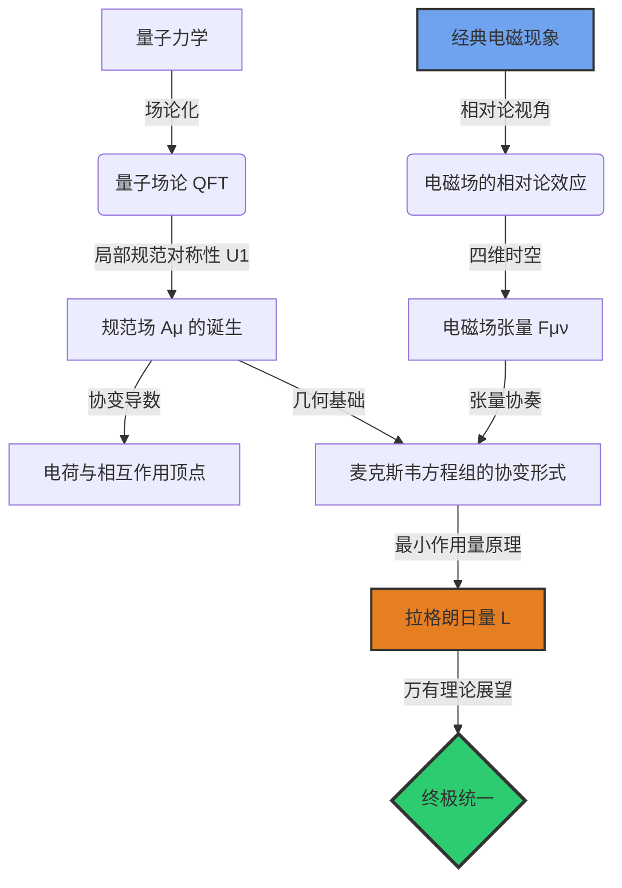

<div align="center">

<!-- 顶部 Logo 或 Banner -->


# ⚡ 现代电磁理论深度解析
### 从经典直觉到终极统一

<!-- 语言切换按钮区域 -->
<p align="center">
    <a href="./README_EN.md">
        
    </a>
    <a href="./README.md">
        
    </a>
</p>

<!-- 状态徽章 -->
[](https://app.netlify.com/sites/electromagnetism-book/deploys)
[](https://creativecommons.org/licenses/by-nc/4.0/)
[](https://en.wikipedia.org/wiki/Theoretical_physics)

<h3>
  <a href="https://electromagnetism-book.netlify.app/">📖 在线阅读本书</a>
  <span> · </span>
  <a href="https://github.com/twx145/EM-BOOK/issues">🐛 勘误与反馈</a>
  <span> · </span>
  <a href="https://github.com/twx145/EM-BOOK/discussions">💬 参与讨论</a>
</h3>

<p align="center">
  <strong>一份写给探索者的地图。</strong><br/>
  不满足于“是什么”，而渴望知道“为什么”。<br/>
  从经典直觉的海岸，航向现代物理学核心大陆的进阶指南。
</p>

</div>

---

## 🌌 项目简介

这不是一本普通的大学物理教材。传统的电磁学教学往往止步于麦克斯韦方程组的积分形式和繁琐的计算练习。

**《现代电磁理论深度解析》** 旨在填补教科书与前沿物理之间的鸿沟。本书以**由浅入深**的逻辑，带领读者重走物理学家的探索之路：从安培定则的宏观现象出发，经由狭义相对论的审视，最终在量子场论和规范对称性的高度上，重新认识我们习以为常的“电”与“磁”。

### 🎯 核心理念
*   **拒绝死记硬背**：每一个公式背后都有其物理生命的源头。
*   **拥抱思想实验**：像爱因斯坦一样思考，在飞船与电荷之间寻找相对论的真相。
*   **直击本质**：从 $\mathbf{E}$ 和 $\mathbf{B}$ 到张量 $F^{\mu\nu}$，再到规范场 $A_\mu$。

---

## 🗺️ 知识架构



---

## 📚 章节概览

| 章节 | 标题 | 核心内容 | 关键词 |
| :--- | :--- | :--- | :--- |
| **第一章** | **风起于青萍之末** | 磁的起源与相对论的初啼。通过思想实验证明“磁场是电场的相对论效应”。 | `安培定则` `洛伦兹力` `长度收缩` |
| **第二章** | **场与粒子** | 量子场论的革命性世界观。粒子不再是永恒的砖块，而是场的量子化激发（涟漪）。 | `量子场论` `零点能` `正反物质` |
| **第三章** | **对称性的胜利** | 为什么会有电磁场？答案在于 U(1) 局部规范对称性。电荷是耦合强度的度量。 | `U(1)对称` `协变导数` `费曼图` |
| **第四章** | **张量语言的优雅** | 构建 $F^{\mu\nu}$。电场和磁场只是同一个四维几何对象在不同侧面的投影。 | `四维矢量` `张量` `闵可夫斯基度规` |
| **第五章** | **宇宙的交响乐** | 将四条麦克斯韦方程组统一为两个张量方程。 | `有源/无源方程` `比安基恒等式` |
| **第六章** | **通往终极统一** | 寻找万物的“种子”：拉格朗日量密度与最小作用量原理。 | `拉格朗日量` `GUT` `弦理论` |

---

## 🎨 精彩试读

### 1. 思想实验：扫过的磁场
为什么静止的电荷不受磁力？哪怕磁场以光速扫过它？
> *“力”不是场单方面的属性，而是场与粒子共同作用的结果。本书通过严格的“法庭质证”，揭示了洛伦兹力的本地化定义与物理实体的区别。*

### 2. 费曼图解析
将复杂的量子相互作用转化为直观的几何图形。
<div align="center">
  <pre>
       e-        e-
       \       /
       \     /
          \~~~/(γ)
       /   \
       /     \
        e-       e-
  </pre>
  <p><i>电子-电子散射（库仑排斥）的微观图像：交换虚光子</i></p>
</div>

### 3. 拉格朗日量的极致简洁
整个经典电磁理论，最终浓缩为一行最优美的公式：

$$ \mathcal{L} = -\frac{1}{4\mu_0} F_{\mu\nu}F^{\mu\nu} - J^\mu A_\mu $$

> *这一行公式包含了高斯定律、安培定律、法拉第定律以及所有的电磁动力学信息。*

---

## 🚀 如何阅读

### 在线阅读 (推荐)
访问我们的 Netlify 部署站点：
👉 **[https://electromagnetism-book.netlify.app/](https://electromagnetism-book.netlify.app/)**

### 本地构建
如果您想在本地运行本书（假设基于 Markdown/VitePress/GitBook）：

```bash
git clone https://github.com/twx145/EM-BOOK.git
cd EM-BOOK
npm install
npm run dev
```

---

## 🤝 贡献与反馈

物理学的探索是无止境的，本书也可能存在疏漏。
如果您发现任何数学错误、物理概念表述不清，或有更好的插图建议，欢迎：

1.  提交 **Issue** 进行讨论。
2.  Fork 本仓库并提交 **Pull Request**。

---

## 📜 许可证

本作品采用 **[知识共享 署名-非商业性使用 4.0 国际 许可协议 (CC BY-NC 4.0)](https://creativecommons.org/licenses/by-nc/4.0/)** 进行许可。

---

<div align="center">
    <strong>Made with ❤️ by twx145</strong>
    <br/>
    <i>"保持你的好奇心，继续追问那个‘为什么’。"</i>
</div>

