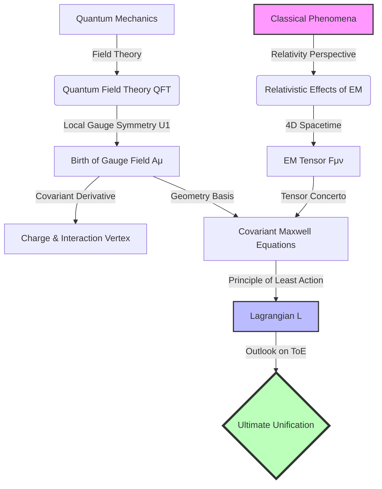

<div align="center">


# ⚡ Modern Electromagnetism: Deep Analysis
### From Classical Intuition to Ultimate Unification

<!-- Language Switcher -->
<p align="center">
    <a href="./README_EN.md">
        
    </a>
    <a href="./README.md">
        
    </a>
</p>

<!-- Badges -->
[](https://app.netlify.com/sites/electromagnetism-book/deploys)
[](https://creativecommons.org/licenses/by-nc/4.0/)
[](https://en.wikipedia.org/wiki/Theoretical_physics)

<h3>
  <a href="https://electromagnetism-book.netlify.app/">📖 Read Online</a>
  <span> · </span>
  <a href="https://github.com/twx145/EM-BOOK/issues">🐛 Report Issues</a>
  <span> · </span>
  <a href="https://github.com/twx145/EM-BOOK/discussions">💬 Discussions</a>
</h3>

<p align="center">
  <strong>A map for the explorer.</strong><br/>
  For those not satisfied with "What", but hungry for "Why".<br/>
  A guide sailing from the coast of classical intuition to the continent of modern physics.
</p>

</div>

---

## 🌌 Introduction

This is not your average university physics textbook. Traditional teaching often stops at the integral forms of Maxwell's equations and tedious calculation exercises.

**"Modern Electromagnetism: Deep Analysis"** aims to bridge the gap between textbooks and frontier physics. With a **progressive logic**, this book leads readers to retrace the path of physicists: starting from the macroscopic phenomena of Ampere's Law, examining them through Special Relativity, and finally redefining "Electricity" and "Magnetism" from the heights of Quantum Field Theory and Gauge Symmetry.

### 🎯 Core Philosophy
*   **No Rote Memorization**: Every formula has a physical origin.
*   **Embrace Thought Experiments**: Think like Einstein—find the truth of relativity between spaceships and charges.
*   **Seek the Essence**: From $\mathbf{E}$ and $\mathbf{B}$ to Tensor $F^{\mu\nu}$, and finally to the Gauge Field $A_\mu$.

---

## 🗺️ Knowledge Architecture



---

## 📚 Chapter Overview

| Chapter | Title | Core Content | Keywords |
| :--- | :--- | :--- | :--- |
| **01** | **Origins & Relativity** | Proving "Magnetism is a relativistic effect of the Electric field" via thought experiments. | `Ampere's Law` `Lorentz Force` `Length Contraction` |
| **02** | **Fields & Particles** | The revolutionary worldview of QFT. Particles are ripples (excitations) in the field. | `QFT` `Zero-point Energy` `Antimatter` |
| **03** | **Triumph of Symmetry** | Why does the EM field exist? The answer lies in U(1) local gauge symmetry. | `U(1) Symmetry` `Covariant Derivative` `Feynman Diagrams` |
| **04** | **Elegance of Tensors** | Constructing $F^{\mu\nu}$. E and B are projections of the same 4D geometric object. | `4-Vector` `Tensor` `Minkowski Metric` |
| **05** | **Symphony of the Universe** | Unifying the four Maxwell equations into two tensor equations. | `Homogeneous/Inhomogeneous` `Bianchi Identity` |
| **06** | **Ultimate Unification** | Finding the "Seed": Lagrangian Density and the Principle of Least Action. | `Lagrangian` `GUT` `String Theory` |

---

## 🎨 Highlights

### 1. The "Sweeping Magnetic Field" Paradox
Why does a stationary charge feel no magnetic force, even if a magnetic field sweeps past it at the speed of light?
> *We reveal that "Force" is not a property of the field alone, but an interaction defined by strictly localized laws.*

### 2. Feynman Diagrams
Visualizing complex quantum interactions.
<div align="center">
  <pre>
      e-         e-
       \       /
        \     /
         \~~~/(γ)
         /   \
        /     \
      e-         e-
  </pre>
  <p><i>Microscopic view of Electron-Electron Scattering: Exchanging a virtual photon</i></p>
</div>

### 3. The Ultimate Conciseness
The entire theory of classical electromagnetism condensed into one beautiful line:

$$ \mathcal{L} = -\frac{1}{4\mu_0} F_{\mu\nu}F^{\mu\nu} - J^\mu A_\mu $$

> *This single formula contains Gauss's Law, Ampere's Law, Faraday's Law, and all electromagnetic dynamics.*

---

## 🚀 How to Read

### Read Online (Recommended)
Visit our Netlify site:
👉 **[https://electromagnetism-book.netlify.app/](https://electromagnetism-book.netlify.app/)**

### Local Build
To run the book locally:

```bash
git clone https://github.com/twx145/EM-BOOK.git
cd EM-BOOK
npm install
npm run dev
```

---

## 🤝 Contribution

Physics exploration is endless. If you find any mathematical errors or unclear concepts, please:

1.  Open an **Issue**.
2.  Fork and submit a **Pull Request**.

---

## 📜 License

This work is licensed under a **[Creative Commons Attribution-NonCommercial 4.0 International License](https://creativecommons.org/licenses/by-nc/4.0/)**.

---

<div align="center">
    <strong>Made with ❤️ by twx145</strong>
    <br/>
    <i>"Stay curious, and keep asking 'Why'."</i>
</div>
